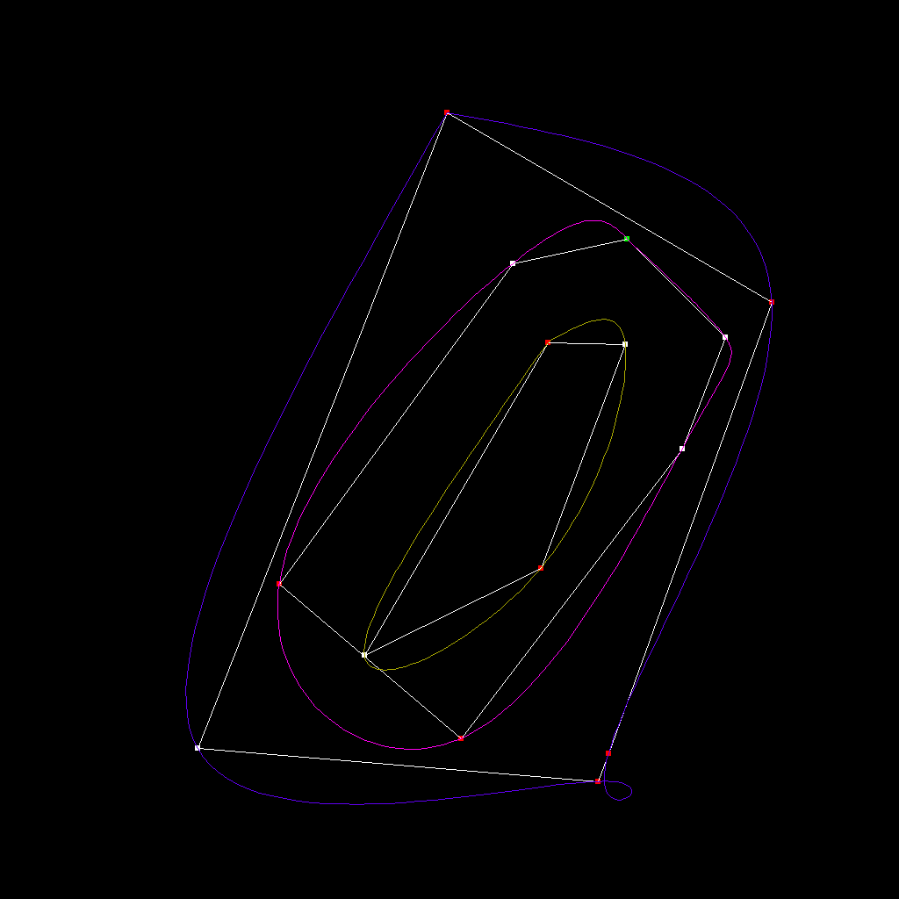
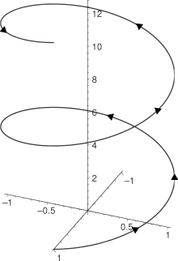

# Splines e polígonos convexos!
Projeto Computação Científica e Análise de Dados ICP252

**Professor**: João Paixão

**Aluno**: Henrique L.C

---

**Parte 1**: Implementar algoritmos de geometria computacional - (Encontrar hull convexa de pontos no plano).

Os Algoritmos descritos e usados aqui foram retirados e estudados dos exemplos e questões do livro `Introduction to Algorithms, CLRS`

**Parte 2**: Implementar algoritmos de interpolação de curvas (splines) usando os métodos um pouco melhores do que vistos em aula.

**Parte 3**: Juntar ambos e tentar deixar bonitinho (Produção de imagens)!

`PS:` O código fonte será escrito em inglês provavelmente. (Alguns comentários podem estar em Português)

--- 

> In Geometry (**which is the only science that it hath pleased God hitherto to bestow on mankind**), men begin at settling the significations of their words; which . . . they call Definitions. 
>
> -- <cite> Thomas Hobbes </cite>

### O Projeto

Usei do projeto para aprender um pouquinho mais sobre um assunto que me surpreende desde sempre que é interpolação.

Para exemplificar o que estudei, peguei outra coisa relacionada com Álgebra linear (mas num campo que parece completamente oposto) que é Geometria Computacional.

O exemplo é o seguinte: Dados pontos gerados aleatóriamente no plano. Vamos comparar o polígono convexo que encompassa esses pontos e a spline fechada que passa por todos os vértices desse polígono.

Uma coisa curiosa teve que me ocorrer, aprendemos com o João como interpolar curvas abertas que começam na esquerda e terminam na direita. Como podemos interpolar então curvas fechadas ou que fazem loops?

---

### Algoritmos:

Para esse projeto eu tinha em mente dois algoritmos :

1. [Spline Interpolation](https://en.wikipedia.org/wiki/Spline_interpolation)
2. [Graham's Scan](https://en.wikipedia.org/wiki/Graham_scan)

Tive, no entanto que implementar o Algorítmo de [Bresemham](https://en.wikipedia.org/wiki/Bresenham%27s_line_algorithm), mas isso não fazia parte do projeto - não estava satisfeito com nenhuma biblioteca gráfica de Go - logo, não vou explica-lo aqui.

---

### Interpolação
PS: O que será dito aqui, será basicamente a solução do problema 28-2 do Cormen (foi o algoritmo que eu usei)

Aprendemos em sala de aula como fazer interpolação de pontos de maneira rápida resolvendo sistemas lineares 8 por 8. No método do paixão, a gente conseguia interpolar suavemente ao adicionar restrições até que nosso sistema ficasse determinado.

#### Definições

Faremos uma coisa levemente diferente aqui, para isso, vamos fazer algumas suposições:

Queremos interpolar $n+1$ pontos $(x_i,y_i), i = 0,1, ...n$ em uma curva suave que será a junção de várias funções cúbicas menores.

Definiremos $n$ funções cúbicas da seguinte forma:
$$ f_i(x) = a_i + b_ix + c_ix^2 + d_ix^3$$
Para $i = 0,1,2,...,n-1$

Satisfazendo as seguintes propriedades:
$$  f_i(0) = y_i $$
$$  f_i(1) = y_{i+1} $$
$$  f'_{i}(1) = f'_{i+1}(0) $$
$$  f''_{i}(1) = f''_{i+1}(0) $$

Para que a curva seja **natural**, vamos obrigar que:
$$f''_0(0) = 0 $$
$$f''_{n-1}(1) = 0 $$

Perceba que há uma falha em nossa construção, estamos ignorando completamente os $x_i$. Isso é fácil de resolver no entanto, se você quer calcular o valor de $x_i \leq x \leq x_{i+1}$, basta considerar:

$$ f_i(\frac{x - x_i}{x_{i+1} - x_i})$$

Mas não vamos nos preocupar muito com isso, não virá ao caso com os nossos problemas.

#### Problema 1.

Suponhamos que Deus foi muito gentil conosco e, além de nos informar os valores de $y_i$. Ele também nos deu os valores das derivadas em cada ponto $D_i = f_i'(0)$ e $D_n = f_{n-1}'(1)$

Será que conseguimos calcular rapidamente os coeficientes das nossas funções usando os valores dados? **A resposta é sim**

Usando as 4 primeiras equações acima temos:

$$ f_i(0) = y_i = a_i $$
$$ f_i(1) = y_{i+1} = a_i + b_i + c_i + d_i $$
$$ f_i'(0) = D_i = b_i $$
$$ f_{i}'(1) = D_{i+1} = b_i + 2c_i + 3d_i $$

Logo, resolvendo para $a_i,b_i,c_i,d_i$ obtemos:

$$ a_i = y_i $$
$$ b_i = D_i $$
$$ c_i = 3\cdot(y_{i+1} - y_i) -D_{i+1} - 2D_i $$
$$ d_i = - 2\cdot(y_i - y_{i+1}) + D_{i+1} + D_i $$
Portanto, se temos todos os valores $y_i$ e $D_i$, conseguimos calcular os $4n$ coeficientes em tempo linear, com essa sequência de operações. (isso é feito em `interpolation/curve.go`)

#### Problema 2.

Vamos mostrar, uma equação muito linda. Para $i = 1,2,...,n-1$

$$ D_{i-1} + 4D_i +D_{i+1} = 3(y_{i+1} - y{i-1}) $$

(Eu tenho certeza que tem haver com a regra de Simpson - Professor, se você souber o porquê me avise!)

Já que queremos que as segundas derivadas sejam contínuas temos:
$$ f''_i(x) = 2c_i + 6d_i $$
$$ f''_{i-1}(1) = 2c_{i-1} + 6d_{i-1} = 2c_i = f''_{i}(0)$$
$$ c_{i-1} + 3d_{i-1} = c_i $$

Podemos usar as equações do **Problema 1** para obter, substituindo $c_{i-1},d_{i-1},c_{i}$:

$$ 3\cdot(y_{i} - y_{i-1}) -D_{i} - 2D_{i-1} + 3\cdot(- 2\cdot(y_{i-1} - y_{i}) + D_{i} + D_{i-1}) =$$ 
$$ = 3\cdot(y_{i+1} - y_i) -D_{i+1} - 2D_i$$

E com bastante manipulação isso se torna justamente:

$$ D_{i-1} + 4D_i +D_{i+1} = 3(y_{i+1} - y{i-1}) $$

Que é muito bonita!!!

#### Problema 3:

Mas o que acontece nas pontas? Quando $i=0$ ou $i = n$?

Vamos mostrar que:
$$ 2D_0 + D_1 = 3(y_1 - y_0) $$
$$ D_{n-1} + 2D_n = 3(y_n - y_{n-1}) $$ 

Para esses valores, vamos lembrar que:
$$f''_0(0) = 0 = c_0$$
$$f''_{n-1}(1) = 0 = 2(c_{n-1} + 3d_{n-1})$$

Temos:

$$2D_0 + D_1 = 3b_0 + 2c_0 + 3d_0 = 3b_0 + 3d_0 = 3(y_1 - y_0)$$

O mesmo tipo de lógica serve para msotrar a segunda equação.

#### Problema 4
Agora finalmente temos a parte mais legal, usando essas duas equações anteriores, podemos escrever a seguinte equação matricial

$$
\begin{align*}
\begin{bmatrix}
2 & 1 & 0 & 0 &  \cdots \\
1 & 4 & 1 & 0 &  \cdots \\
0 & 1 & 4 & 1 &  \cdots \\
\vdots &  \vdots & \vdots & \vdots \\
0&0&0&0&\cdots& 1 & 2 & 1 \\
0&0&0&0&\cdots& 0& 1 & 2
\end{bmatrix}
&
\begin{bmatrix}
D_0\\
D_1\\
D_2\\
\vdots\\
D_{n-1}\\
D_{n}
\end{bmatrix}

= 3\cdot
\begin{bmatrix}
y_1 - y_0\\
y_2 - y_0\\
y_3 - y_1\\
\vdots\\
y_n - y_{n-2}\\
y_n - y_{n-1}\\
\end{bmatrix}
\end{align*}
$$

E esse sistema é muito bonito.

A matriz é **tridiagonal** e **positivamente-definida**. Sobre a primeira, eu convido ao leitor fazer a decomposição **LU** desse sistema, perceba o quão rápido é fazê-lo.

Sobre ela ser positivamente-definida é importante por motivos mais técnicos (significa que fazer LU nela é bem estável) - mas essa conversa não foi vista em aula.

 Aconselho ler o Capitulo 28.3 do Cormen para um estudo melhor de matrizes positivamente definidas

**Fazer LU em matrizes tridiagonais de tamanho $n$ custa somente $O(n)$**, isso acontece pois só temos que considerar a linha diretamente abaixo do pivô. A implementação pode ser vista em `matrix/trigonal.go`. 

Além disso, podemos ser espertos na implementação e só guardar as três diagonais, economizando espaço.

Mais legal que isso, (se você de fato fez o LU perceberá), as matrizes L e U são bidiagonais. Então, fazer substituição também é muito veloz $O(n)$.

Portanto, podemos resolver esse sistema e encontrar os valores de $D_i$ em tempo $O(n)$. E como vimos anteriormente, a partir dos valores $D_i$ e $y_i$, podemos determinar os coeficientes em tempo linear também.

Em conclusão, consiguimos encontrar os coeficientes de cada $f_i$ em $O(n)$.

### O que eu tive que pensar sozinho

O que vimos até agora, (que é super rapido de calcular) substitui o que vimos em sala de maneira bem elegante. Mas não é suficiente para resolver nosso problema.

Conseguimos interpolar pontos $(x_i,y_i)$ contanto que tenhamos:
$$ x_0 < x_1 < \cdots < x_{n-1} < x_n $$

Mas nossos pontos estão no plano, eles dão voltas e a curva deve ser fechada!

Nesse momento eu não sabia muito o que fazer, (não tem nada escrito no livro sobre isso). 

Mas, durante uma festa com minha mãe veio me a seguinte ideia:

Eu só sei interpolar em relação a uma dimensão.

E se meus pontos não estivessem no plano? Se eles estivessem espalhados pelo espaço, eu poderia interpolar as coordenadas $x_i$ em relação a $z$. E eu poderia fazer o mesmo com  as coordenadas $y_i$!

Depois disso, eu poderia projetar as curvas no plano $xy$, achatando o que eu consegui.

Na minha mente veio a seguinte imagem:

